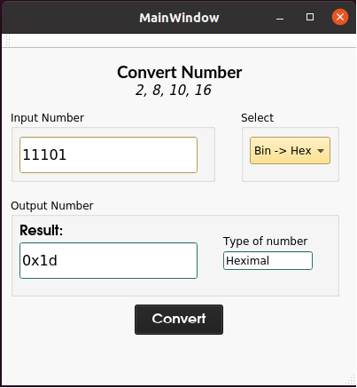

# convert-device-driver-with-ui

 

Basic character device driver for convert base 2,8,10,16 number.
  - UI: Main Application using Qt Creator
  - driver-module: Main module driver that include source code of module convert and register device driver to kernel.

How to use?
  1. Insert driver module
    
    Run below code:
    git clone https://github.com/lil-dua/convert-device-driver-with-ui
    cd driver-module
    make clean
    make
    sudo insmod driver_cd.ko
    sudo chmod 777 /dev/driver_chuyendoi
    
  3. Run application

    Open Qt Creator and select inside folder UI a file end with .pro
    Build and run application
